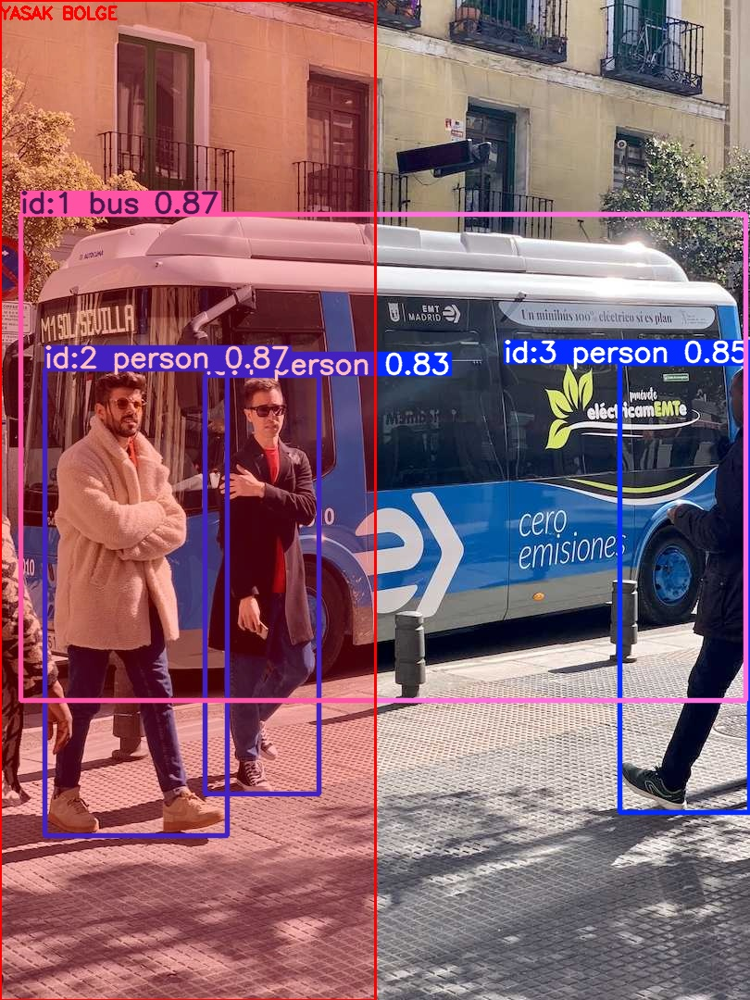
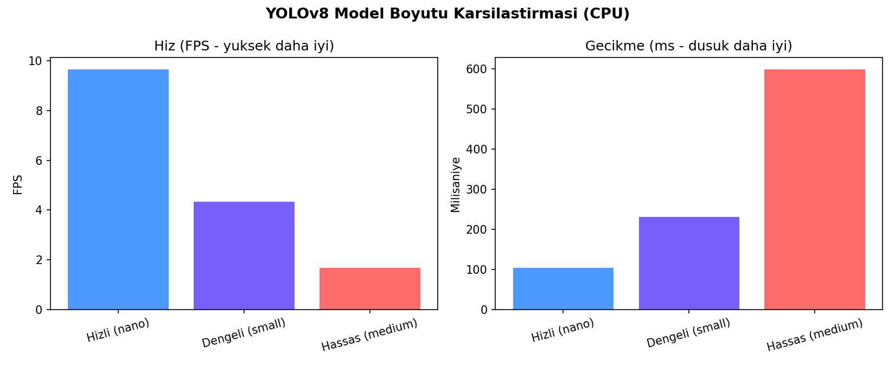
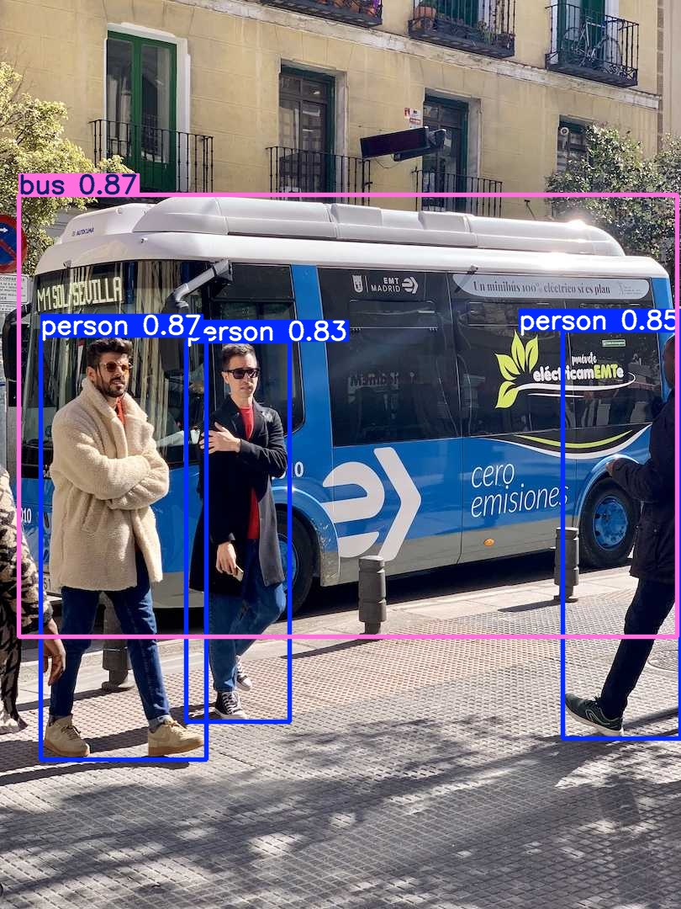

# 🎯 Hedef Tespit, Takip ve Güvenlik Olayı İzleme Sistemi

YOLOv8 tabanlı, **interaktif web arayüzlü** bir bilgisayarlı görü sistemi. Görüntü, video ve
webcam üzerinde gerçek zamanlı nesne tespiti + takibi yapar; bunun üzerine **davranış tabanlı
güvenlik olayı analizi** katmanı ekler (yasak bölge ihlali, sahipsiz nesne, uzun süre bekleme).


## 📌 Proje Hakkında

Bu proje iki şekilde kullanılabilir:

1. **Web Dashboard (`app.py`)** — Streamlit ile geliştirilmiş, tarayıcıda açılan tam interaktif
   arayüz. Görüntü/video yükleyip anlık tespit sonucu görebilir, webcam ile kare yakalayabilir,
   video üzerinde **güvenlik izleme modunu** açıp yasak bölge/sahipsiz nesne/loitering
   olaylarını canlı görebilir ve tüm geçmişi grafiklerle inceleyebilirsin.
2. **Komut satırı aracı (`src/detect.py`)** — Sürekli webcam akışı ya da toplu video işleme için
   hafif, arayüzsüz alternatif.

Amaç; nesne tespiti, takip, davranış analizi ve gerçek zamanlı veri işleme gibi otonom/güvenlik
sistemlerinde kullanılan uçtan uca bir bilgisayarlı görü hattını (pipeline) uygulamalı olarak
göstermek.

## 🚀 Özellikler

- ✅ **Web dashboard**: görüntü/video/webcam üzerinde tıkla-çalıştır arayüz
- ✅ **Nesne takibi**: ByteTrack ile videoda her nesneye kalıcı ID atama
- ✅ **Güvenlik olayı izleme**: yasak bölge ihlali, sahipsiz nesne, uzun süre bekleme (loitering)
- ✅ **Gelişmiş Tespit Modu**: yüksek çözünürlük (imgsz=1280) + test-time augmentation ile küçük/uzak nesnelerde daha güvenilir tespit
- ✅ 3 farklı YOLOv8 model boyutu arasında canlı geçiş (hız/hassasiyet dengesi)
- ✅ Sınıf bazlı filtreleme ve ayarlanabilir güven eşiği
- ✅ Tüm tespitlerin ve güvenlik olaylarının ayrı ayrı kalıcı loglanması (`data/*.csv`)
- ✅ İnteraktif analiz sayfaları: sınıf dağılımı, zaman çizelgesi, olay şiddeti dağılımı
- ✅ Ayrı, arayüzsüz CLI script'i ile sürekli webcam/video işleme
- ✅ 32 pytest birim testi + her push'ta otomatik çalışan CI (GitHub Actions)
- ✅ Docker desteği

## 🖥️ Mimari

```
app.py                       -> Streamlit web dashboard (4 sayfa: Tespit / Analiz / Güvenlik Olayları / Hakkında)
utils/detector.py             -> YOLOv8 sarmalayıcısı (tespit + takip + Gelişmiş Tespit Modu)
utils/security_events.py       -> Davranış tabanlı güvenlik olayı durum makinesi
utils/logger.py                -> Tespit + olay geçmişini CSV'ye yazma/okuma (pandas)
src/detect.py                   -> Komut satırından çalışan CLI alternatifi
scripts/benchmark.py             -> Model boyutlarının hız/hassasiyet karşılaştırması
tests/                            -> 32 pytest birim testi (detector, logger, security_events)
.github/workflows/ci.yml         -> Her push'ta testleri otomatik çalıştıran GitHub Actions
Dockerfile                        -> Konteynerde çalıştırma desteği
data/history.csv, data/events.csv -> Kalıcı tespit ve olay geçmişi (otomatik oluşur)
```

## 🚨 Güvenlik Olayı İzleme

Tek bir karedeki nesne tespiti "burada bir insan var" diyebilir ama "bu normal mi, tehlikeli mi"
sorusuna cevap veremez. Gerçek güvenlik/perimeter sistemleri bunun yerine **zaman içindeki
davranışa** bakar. `utils/security_events.py`, her takip edilen nesne (track ID) için ayrı bir
durum makinesi çalıştırarak 3 davranış kalıbını modelliyor:

| Olay | Ne zaman tetiklenir | Önem |
|------|----------------------|------|
| **Yasak Bölge İhlali** | Bir kişi tanımlı bir alana girdiğinde | 🔴 Kritik |
| **Sahipsiz Nesne** | Bir çanta/valiz, yanında kimse olmadan belirli bir süre hareketsiz kaldığında | 🔴 Kritik |
| **Uzun Süre Bekleme (Loitering)** | Bir kişi alanda beklenenden uzun süre kaldığında | 🟠 Uyarı |

Aşağıda, örnek görüntü üzerinde sol yarıyı "yasak bölge" olarak tanımlayıp çalıştırdığım gerçek
çıktı var — sistem 2 kişiyi bölgede tespit edip otomatik olarak ihlal olayı üretti:



```
2 guvenlik olayi uretildi:
  - [KRITIK] ZONE_IHLALI: Kisi #2 yasak bolgeye girdi
  - [KRITIK] ZONE_IHLALI: Kisi #4 yasak bolgeye girdi
```

Aynı sistemi 10 karelik bir simülasyonda çalıştırdığımda (aynı kişiler ekranda 9 saniye kaldı,
loitering eşiği 5 saniye), 3 kişi için de otomatik uyarı üretildi ve `data/events.csv`'ye
kaydedildi:

```
[t=5s] UYARI - Kisi #2 5 saniyedir alanda
[t=5s] UYARI - Kisi #3 5 saniyedir alanda
[t=5s] UYARI - Kisi #4 5 saniyedir alanda
```

Her olay türü, tekrar tetiklenmeyi önleyen bir "fired" bayrağı kullanır (örn. bir kişi bölgeden
çıkıp tekrar girmeden ikinci kez ihlal sayılmaz) — bu mantığın tamamı `tests/test_security_events.py`
içinde 11 ayrı senaryoyla doğrulanmıştır.

> ⚠️ **Not:** Bu, eğitim/portföy amaçlı, basitleştirilmiş bir sezgisel (heuristic) sistemdir —
> sertifikalı bir güvenlik ürünü değildir. Gerçek dünya kullanımı için çok daha fazla doğrulama,
> farklı ışık/açı/kalabalık koşullarında test ve yanlış alarm (false positive) analizi gerekir.

## 📊 Model Karşılaştırması (Benchmark)

Üç farklı YOLOv8 boyutunun aynı görüntü üzerindeki hız/hassasiyet dengesini ölçtüm
(CPU üzerinde, 5 tekrarın ortalaması):



| Model | Ortalama Süre | FPS | Tespit Sayısı |
|-------|---------------|-----|----------------|
| Hızlı (nano) | ~103 ms | ~9.7 | 4 |
| Dengeli (small) | ~230 ms | ~4.3 | 5 |
| Hassas (medium) | ~599 ms | ~1.7 | 5 |

Bu, gerçek zamanlı sistemlerde (örneğin gömülü bir kartta çalışan bir otonom sistemde) neden
model seçiminin bir mühendislik kararı olduğunu gösteriyor: nano model ~6x daha hızlı ama bir
nesneyi kaçırabiliyor. Kendi ortamında tekrar üretmek için:
```bash
python scripts/benchmark.py
```

## 🧪 Testler

Proje, `utils/detector.py`, `utils/logger.py` ve `utils/security_events.py` için pytest ile
yazılmış **32 birim testi** içerir. Her `main` dalına push'ta bu testler **GitHub Actions** ile
otomatik çalışır (yukarıdaki "Tests" rozeti anlık durumu gösterir).

```bash
pip install pytest
pytest tests/ -v
```

## 🐳 Docker ile Çalıştırma

```bash
docker build -t hedef-tespit-sistemi .
docker run -p 8501:8501 hedef-tespit-sistemi
```
Ardından tarayıcında `http://localhost:8501` adresini aç.

## 🖼️ Örnek Sonuç

Aşağıda sistemin bir test görüntüsü üzerindeki çıktısı gösterilmektedir (4 nesne tespit edildi:
1 otobüs, 3 kişi):



```
[INFO] 4 nesne tespit edildi.
   - bus: %87.3 guven
   - person: %86.6 guven
   - person: %85.3 guven
   - person: %82.5 guven
```

## 🔧 Kurulum

```bash
git clone https://github.com/baranakbaba/hedef-tespit-sistemi.git
cd hedef-tespit-sistemi
python -m venv venv
venv\Scripts\activate          # Windows
# source venv/bin/activate     # Mac/Linux
pip install -r requirements.txt
```

## ▶️ Kullanım

**Web dashboard'u başlatmak için (önerilen):**
```bash
streamlit run app.py
```
Tarayıcında `http://localhost:8501` otomatik açılır. "Tespit Çalıştır" → "Video + Güvenlik
İzleme" sekmesinden bir video yükleyip "Güvenlik İzleme"yi aç, yasak bölgeyi yüzde olarak
tanımla ve videoyu işle — canlı olarak ihlal/alarm sayacını göreceksin.

**Komut satırından çalıştırmak için:**

Görüntü üzerinde:
```bash
python src/detect.py --source assets/ornek.jpg --output examples/sonuc.jpg
```

Webcam üzerinde gerçek zamanlı:
```bash
python src/detect.py --source 0
```

Video dosyası üzerinde:
```bash
python src/detect.py --source video.mp4 --output sonuc_video.mp4
```

**Parametreler:**

| Parametre  | Açıklama                                      | Varsayılan   |
|------------|------------------------------------------------|--------------|
| `--source` | Görüntü/video yolu ya da webcam için `0`        | `0`          |
| `--model`  | Kullanılacak YOLOv8 ağırlığı                    | `yolov8n.pt` |
| `--conf`   | Minimum güven skoru eşiği                       | `0.4`        |
| `--output` | Sonucun kaydedileceği dosya yolu (opsiyonel)    | `None`       |

## 🧠 Nasıl Çalışır?

1. YOLOv8 modeli (Ultralytics) yüklenir, video/webcam için ByteTrack ile takip ID'si atanır.
2. Her karedeki tespitler `utils/security_events.SecurityMonitor`'a beslenir.
3. Monitor, her track ID'nin pozisyon geçmişini tutar; bölge/hareketsizlik/süre kurallarını
   kontrol edip yeni bir davranış kalıbı tetiklendiğinde `SecurityEvent` üretir.
4. Sonuçlar hem `results[0].plot()` ile hem de bölge/alarm bindirmesiyle görselleştirilir,
   `data/history.csv` ve `data/events.csv`'ye kaydedilir.

## 🗺️ Yol Haritası

- [x] Nesne takibi (ByteTrack entegrasyonu)
- [x] Web arayüzü (Streamlit)
- [x] Davranış tabanlı güvenlik olayı izleme (bölge/sahipsiz nesne/loitering)
- [x] Gelişmiş Tespit Modu (yüksek çözünürlük + TTA)
- [x] Geçmiş tespitlerin ve olayların loglanması ve analizi
- [x] Birim testleri (pytest) + otomatik CI (GitHub Actions)
- [x] Docker desteği
- [x] Model boyutu karşılaştırması (benchmark)
- [ ] Açık kelime dağarcığı ile tespit (YOLO-World) — denendi, CLIP bileşeni için ek bir
      indirme gerektiriyor; kendi bilgisayarında denemek istersen `pip install ultralytics[yolo-world]` sonrası `model.set_classes([...])` ile mümkün
- [ ] Özel veri seti ile fine-tuning
- [ ] Raspberry Pi / Jetson üzerinde gerçek zamanlı optimizasyon

## 📄 Lisans

Bu proje [MIT lisansı](LICENSE) ile lisanslanmıştır.
